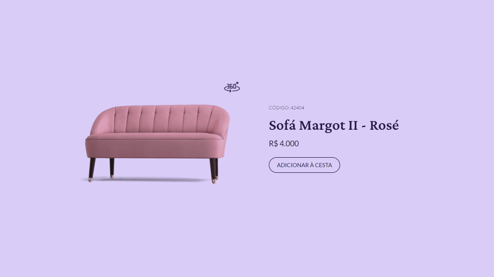
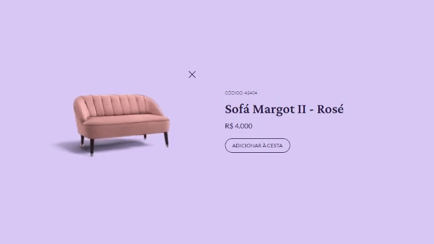

<h1 align="center">
  
</h1>

  <a href="https://www.figma.com/community/file/1195050984449538256">Week #02</a> challenge from <a href="https://boracodar.dev/">#boraCodar</a> by <a href="https://www.rocketseat.com.br/">Rocketseat</a>

<h3 align="center">
  Product Card 🛍
</h3>

  

<h2>📋 The challenge</h2>

The challenge was to build the player as specified <a href="https://www.figma.com/community/file/1195050984449538256">here</a>, using any preferred technologies.

- The "360°" button should show a 3D model preview of the product

 

  

<h3>🧪 Built with</h3>

- HTML
- CSS
- JavaScript

<h3>🔗 Links</h3>

- Live Site URL: [https://phislipe.github.io/boracodar-02/](https://phislipe.github.io/boracodar-02/)

---

  Made by <a href="https://phislipe.dev"><b>Philipe Rocha</b></a>

